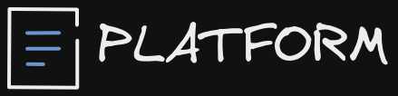
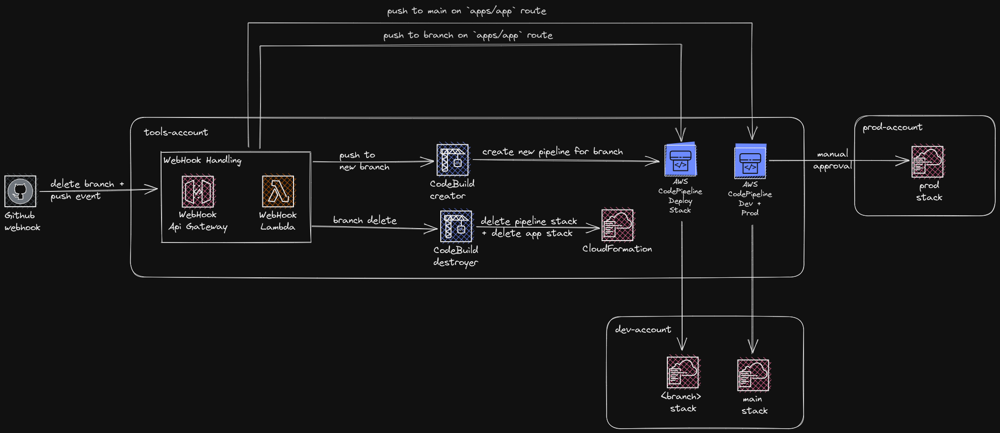

# Welcome to the Platform

The Platform Project is an attempt to make a Contact Driven Development (OpenAPI, AsyncAPI Driven development) possible with AWS CDK, with a pleasant Local Development Experience, without compromise.

## Current Feature set:

- 📄 OpenAPI based end-to-end type safety (with code generation)
- 🏗️ Full infrastructure to deploy an application with:
  - vite frontend
  - micro service lambda backend
- 🖼️ Preview environment (deployment on each new branch)
- 🧪 E2E tests with playwright on each branch
- 🏡 Can be started on localhost (with [openapi-backend](https://github.com/anttiviljami/openapi-backend) and [express](https://expressjs.com/))

## Architecture

Current Architecture:

Upcoming features:

- [ ] Post comment on PR with API + Frontend endpoints
- [ ] Kysely query builder with RDS on cloud and SQLite for testing
- [ ] AsyncAPI with EventBridge
- [ ] Rollback on failed E2E on PROD
- [ ] Tool to generate .env for local development (can be gathered with `aws cloudformation describe-stacks`)
